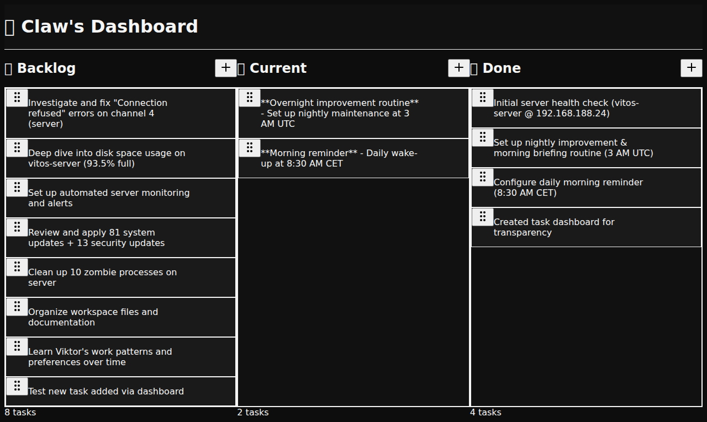
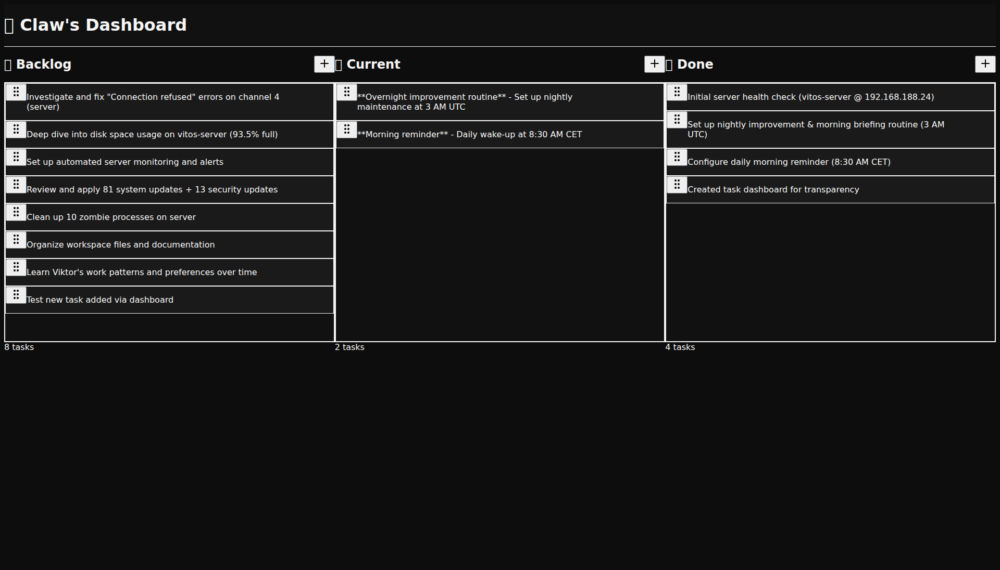

# Dashboard v2 🎯

An interactive task dashboard built with Next.js, Tailwind CSS, and shadcn/ui. Manages tasks through a clean, drag-and-drop interface that reads from and writes to a local `DASHBOARD.md` file.

[](https://nextjs.org/)
[](https://www.typescriptlang.org/)
[](https://tailwindcss.com/)

## ✨ Features

- **📋 Three-column Kanban board** - Backlog, Current, and Done
- **🖱️ Drag & Drop** - Smooth task movement between columns using @dnd-kit
- **📝 File-based storage** - Reads/writes from `DASHBOARD.md` (no database required)
- **⚡ Real-time updates** - Changes instantly persist to the markdown file
- **🎨 shadcn/ui components** - Beautiful, accessible UI components
- **⌨️ Keyboard shortcuts**
  - `⌘K` / `Ctrl+K` - Add new task
  - `⌘⇧K` / `Ctrl+Shift+K` - Quick add to Current
  - `⌘/` / `Ctrl+/` - Open help
- **🔊 Audio feedback** - Satisfying completion sounds
- **📱 Mobile responsive** - Works seamlessly on all devices
- **🏷️ Priority badges** - Visual indicators for task priority
- **📅 Due dates** - Optional date tracking
- **🌙 Dark theme** - Linear-inspired dark UI

## 🚀 Quick Start

### Prerequisites

- Node.js 18+ and npm
- A `DASHBOARD.md` file in your workspace (or it will be created automatically)

### Installation

```bash
# Clone the repository
git clone https://github.com/vitoleonardo/dashboard-v2.git
cd dashboard-v2

# Install dependencies
npm install

# Run development server
npm run dev
```

Open [http://localhost:3000](http://localhost:3000) to see the dashboard.

### Production Build

```bash
# Build for production
npm run build

# Start production server
npm start
```

## 🏗️ Tech Stack

- **Framework:** [Next.js 16](https://nextjs.org/) (App Router)
- **Language:** [TypeScript 5](https://www.typescriptlang.org/)
- **Styling:** [Tailwind CSS 3.4](https://tailwindcss.com/)
- **UI Components:** [shadcn/ui](https://ui.shadcn.com/)
  - Button, Card, Dialog, Toast, Badge, Input, Textarea
- **Drag & Drop:** [@dnd-kit](https://dndkit.com/)
- **Icons:** [Lucide React](https://lucide.dev/)
- **Themes:** [next-themes](https://github.com/pacocoursey/next-themes)
- **Notifications:** [Sonner](https://sonner.emilkowal.ski/)

## 📂 Project Structure

```
dashboard-v2/
├── app/
│   ├── api/
│   │   └── tasks/
│   │       └── route.ts           # API endpoints for DASHBOARD.md I/O
│   ├── components/
│   │   ├── AddTaskDialog.tsx      # New task creation modal
│   │   ├── TaskCard.tsx           # Individual draggable task card
│   │   ├── TaskColumn.tsx         # Column container with drop zone
│   │   └── TaskDialog.tsx         # Task edit/view modal
│   ├── hooks/
│   │   └── useKeyboardShortcuts.ts # Global keyboard shortcuts
│   ├── types/
│   │   └── task.ts                # TypeScript interfaces
│   ├── utils/
│   │   └── sounds.ts              # Audio feedback utilities
│   ├── globals.css                # Global styles + Linear dark theme
│   ├── layout.tsx                 # Root layout
│   └── page.tsx                   # Main dashboard page
├── components/
│   └── ui/                        # shadcn/ui components
├── lib/
│   └── utils.ts                   # Utility functions (cn, etc.)
├── public/
│   └── sounds/                    # Sound effects
└── package.json
```

## 🎮 Usage

### Adding Tasks

1. Click the `+ Add Task` button in any column header
2. Or press `⌘K` / `Ctrl+K` to add to Backlog
3. Or press `⌘⇧K` / `Ctrl+Shift+K` to add to Current
4. Fill in title, description (optional), priority, and due date
5. Click "Add Task"

### Moving Tasks

- **Drag & Drop:** Click and drag task cards between columns
- **Edit Dialog:** Click the edit icon → change status dropdown

### Editing Tasks

- Click the edit icon (pencil) on any task card
- Update title, description, priority, due date, or status
- Click "Save Changes"

### Deleting Tasks

- Click the delete icon (trash) on any task card
- Or open the edit dialog and click "Delete Task"

### Keyboard Shortcuts

Press `⌘/` or `Ctrl+/` to see all available shortcuts.

## 📄 DASHBOARD.md Format

The dashboard reads and writes to `DASHBOARD.md` with this structure:

```markdown
# Dashboard

## 🗂️ Backlog (4)

- [ ] Task title | Description goes here | priority:high | due:2026-02-10
- [ ] Another task

## 🔥 Current (2)

- [ ] Working on this now | Important work | priority:medium

## ✅ Done (3)

- [x] Completed task | priority:low
```

- Tasks use markdown checkboxes (`- [ ]` or `- [x]`)
- Title and metadata are separated by `|`
- Metadata format: `priority:low|medium|high`, `due:YYYY-MM-DD`

## 🎨 Customization

### Changing Theme Colors

Edit `app/globals.css` to customize the color scheme:

```css
:root {
  --background: 0 0% 5%;      /* #0d0d0d */
  --card: 0 0% 10%;           /* #1a1a1a */
  --primary: 220 100% 60%;    /* Accent color */
}
```

### Adding More Columns

Edit `app/page.tsx` and update the `TaskStatus` type in `app/types/task.ts`:

```typescript
export type TaskStatus = "backlog" | "current" | "done" | "archived";
```

### Custom Sound Effects

Replace audio files in `public/sounds/` or update `app/utils/sounds.ts`.

## 🧪 Testing

```bash
# Run Playwright tests
npx playwright test

# Take screenshots
node screenshot-test.js
```

## 📸 Screenshots

### Main Dashboard


### Task Dialog


## 🛠️ Development

### Adding New shadcn/ui Components

```bash
npx shadcn@latest add [component-name]
```

### File Watching

The dashboard automatically reloads when `DASHBOARD.md` changes (with Next.js dev server).

### API Endpoints

- `GET /api/tasks` - Fetches parsed tasks from DASHBOARD.md
- `POST /api/tasks` - Saves tasks back to DASHBOARD.md

## 🤝 Contributing

Contributions are welcome! Please feel free to submit a Pull Request.

1. Fork the repository
2. Create your feature branch (`git checkout -b feature/AmazingFeature`)
3. Commit your changes (`git commit -m 'Add some AmazingFeature'`)
4. Push to the branch (`git push origin feature/AmazingFeature`)
5. Open a Pull Request

## 📝 License

This project is open source and available under the [MIT License](LICENSE).

## 🙏 Acknowledgments

- [shadcn/ui](https://ui.shadcn.com/) for the beautiful component library
- [dnd-kit](https://dndkit.com/) for the drag & drop functionality
- [Linear](https://linear.app/) for design inspiration
- [Next.js](https://nextjs.org/) team for the amazing framework

## 📧 Contact

Vito Leonardo - [@vitoleonardo](https://github.com/vitoleonardo)

Project Link: [https://github.com/vitoleonardo/dashboard-v2](https://github.com/vitoleonardo/dashboard-v2)

---

Made with ❤️ using Next.js and shadcn/ui
